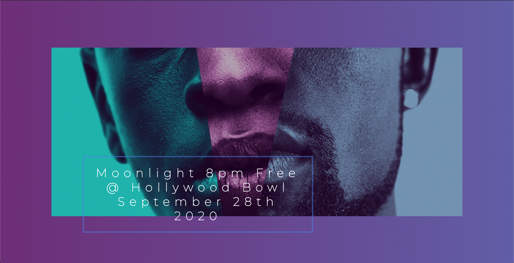

##  <h3 align = "center"> Magnem Opus </h3>

    

## Project Description 
      This is an event production and ticketing program that gives a user multiple options to produce an event, attend an event, or list their foodtruck or entertainment services in our database.  The event production option will give a user event locations to choose from as well as vendors they can hire for their event.  The event will be listed in our databse for anyone interested in attending.  If a ticket buyer wants to attend an event they simply need to request a ticket and then choose a meal from the food options available.  They will be assigned a ticket reservation number with their food option.  This app is designed to be the one stop shopping for all event coordinators, entertainers, food service providers, and audience members!
                        
 ## Table of Contents
* [Project Description](#project-description)
* [Installation Instructions](#installation-instructions)
* [Usage Information](#usage-information)
* [Contribution Guidelines](#contribution-guidelines)
* [Test Instructions](#test-instructions)
* [Questions](#questions)

    
 
## Licenses    
    This applicaiton is covered with:
    

    
    This is an event production and ticketing program that gives a user multiple options to produce an event, attend an event, or list their foodtruck or entertainment services in our database.  The event production option will give a user event locations to choose from as well as vendors they can hire for their event.  The event will be listed in our databse for anyone interested in attending.  If a ticket buyer wants to attend an event they simply need to request a ticket and then choose a meal from the food options available.  They will be assigned a ticket reservation number with their food option.  This app is designed to be the one stop shopping for all event coordinators, entertainers, food service providers, and audience members!
                        
 ## Installation Instructions

    No installation required, all the user has to do is visit our website to input their event information or vendor information.  The website does require a login and password.
                        
 ## Usage Information
 
    This program utilizes Materialize, TweenMax, TimelineMax, and MySQL datbases.
                        
 ## Contribution Guidelines
 
    Sophia Castillo, Ryan Braun, Richard Antolin, and Darren Huang
                        
 ## Test Instructions
 
    No test instructions
                        
 ## Questions
 
                        Feel free to contact me via Gifthub or by my e-mail!
Github Username:  rbraun04

 <a href = "https://github.com/rbraun04">GitHub</a> - Click to go to my profile!

 Email:  ryan@thelyricla.com

 [![LinkedIn][linkedin-shield]][linkedin-url]

[linkedin-shield]: https://img.shields.io/badge/-LinkedIn-black.svg?style=flat-square&logo=linkedin&colorB=555
[linkedin-url]: https://linkedin.com/in/ryangbraun
[Boost-shield]: https://img.shields.io/badge/License-Boost%201.0-lightblue.svg
[Boost-url]: https://www.boost.org/LICENSE_1_0.txt
                       